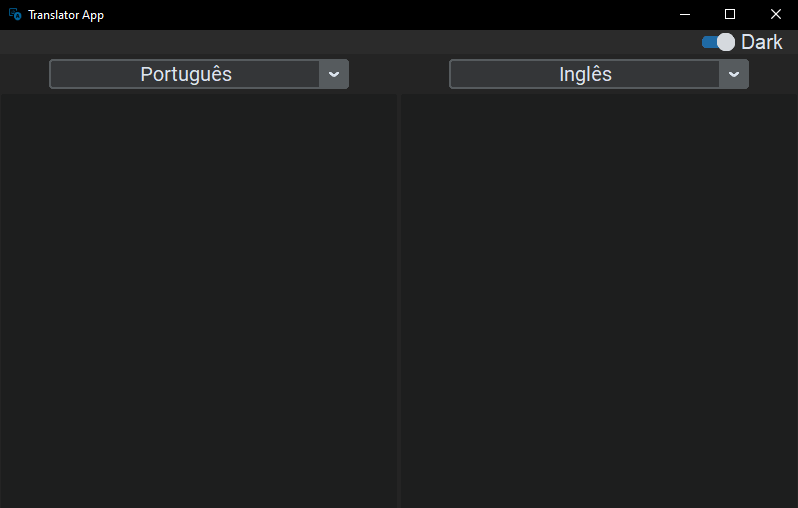

# Translator App Desktop



## **Feature:**
* **📋 Translate any text you want**

## **Instructions:**

### **1. Install 🐍 `python` on your machine, through [this link](https://www.python.org/)**

### **2. Make the clone [of this repository](https://github.com/yRedskull/Translator-App.git) on your machine:**

* Create a folder on your computer for this program, I recommend putting the name **Translator-App** <br>
* **Open `Git Bash` or` Terminal` Within this folder <br>**
* Copy the [URL] (https://github.com/yRedskull/Translator-App.git)
* Enter `git clone <copy>` and press `Enter` <br>
* **You can also access by [GitHub Desktop](https://desktop.github.com/) <br>**
* Open your `Github desktop` <br>
* Click `File` in the upper left corner <br>
* Select the `Clone Repository ...` and go to the tab `URL` <br>
* Paste the repository, indicate the folder where it should appear and click `Clone` <br>

### **3. Execution 🦈**
* **Enter the folder where the repository was cloned**
* Download the necessary packages
```
pip install -r requirements.txt
``` 
* And run
```
py run.py
```
